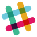

## Upcoming events

**2018-10-12 + 13 - CloudBrew 2018** - Two days of Microsoft Azure! We will have some local and international speakers who will share their knowledge and experience. Two days and lots of sessions! [Register here!](https://www.cloudbrew.be){: .btn .btn--success}
{: .notice--info}

## About AZUG

AZUG is a Belgian user group with focus on development and architecture of Microsoft's Azure cloud platform. Our goal is to share knowledge and experiences with the .NET community on working with and developing for this platform. We do this by bringing together developers, architects, consultants and enthusiasts and give them the opportunity to gather knowledge and insights from industry speakers, both local and international.

There are many benefits to participating in AZUG:

* Learn best practices and optimal use of Microsoft's cloud platform
* Get answers, advice, tips and suggestions from experts and peers
* Gain new insights and ideas in how to apply Microsoft's cloud platform
* Network with local peers
* Be on the cutting edge of technology, be part of the future

		&nbsp;
		&nbsp;
		&nbsp;
		
		 
		&nbsp;
		&nbsp;
		&nbsp;
		
		 
		&nbsp;
		&nbsp;
		&nbsp;
		
		 
		&nbsp;
		&nbsp;
		&nbsp;
		
		 
		&nbsp;
		&nbsp;
		&nbsp;
		
		 
		&nbsp;
		&nbsp;
		&nbsp;
		

## Join us, stay informed

Becoming a member of AZUG is free! Events are organized and announced through:

*  Our [newsletter](#newsletter) - this is the primary announcement channel and we recommend subscribing to it.
*  Our [Slack team](#slack) - for announcements and community discussions.

### Newsletter 

Join our newsletter and be among the first to hear about new events and meetups.

<form id="mc-embedded-subscribe-form" class="validate" action="https://azug.us2.list-manage.com/subscribe/post?u=47e1708de98684b0f393d63b3&amp;id=9463ee7106" method="post"> 
<table border="0" cellspacing="2" cellpadding="2">
<tbody>
<tr>
<td><input id="mce-EMAIL" class="required email" name="EMAIL" type="text" placeholder="Your e-mail"></td>
<td><input id="mce-FNAME" class="required" name="FNAME" type="text" placeholder="Your firstname"></td>
<td><input id="mce-LNAME" class="required" name="LNAME" type="text" placeholder="Your lastname"></td>
</tr>
<tr>
<td style="text-align: right;" colspan="3"><input id="mc-embedded-subscribe" class="btn btn--x-large" name="subscribe" type="submit" value="Subscribe"></td>
</tr>
</tbody>
</table>
</form>

### Slack

Next to our [newsletter](#newsletter), we have a [Slack team](https://join.slack.com/t/azugbe/shared_invite/MjE4MzI5NDM3OTM5LTE1MDExNDgyMzUtMzgwNjM2YmU0Zg) where we announce new events and provide a way of discussing topics that are relevant to the AZUG community.

[ Join our Slack team  now!](https://join.slack.com/t/azugbe/shared_invite/MjE4MzI5NDM3OTM5LTE1MDExNDgyMzUtMzgwNjM2YmU0Zg)

## Microsoft Azure?

The Microsoft Azure platform is a flexible cloud–computing platform that lets you focus on solving business problems and addressing customer needs. No need to invest upfront on expensive infrastructure. Pay only for what you use, scale up when you need capacity and pull it back when you don’t.

&raquo; Find out more on [www.azure.com](http://www.azure.com)
